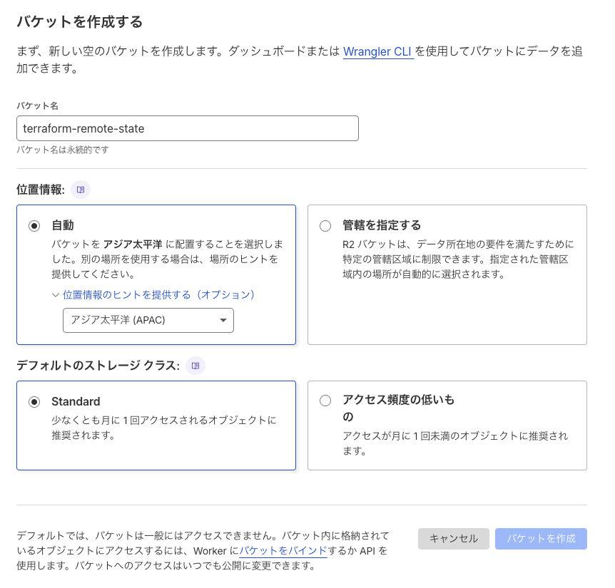
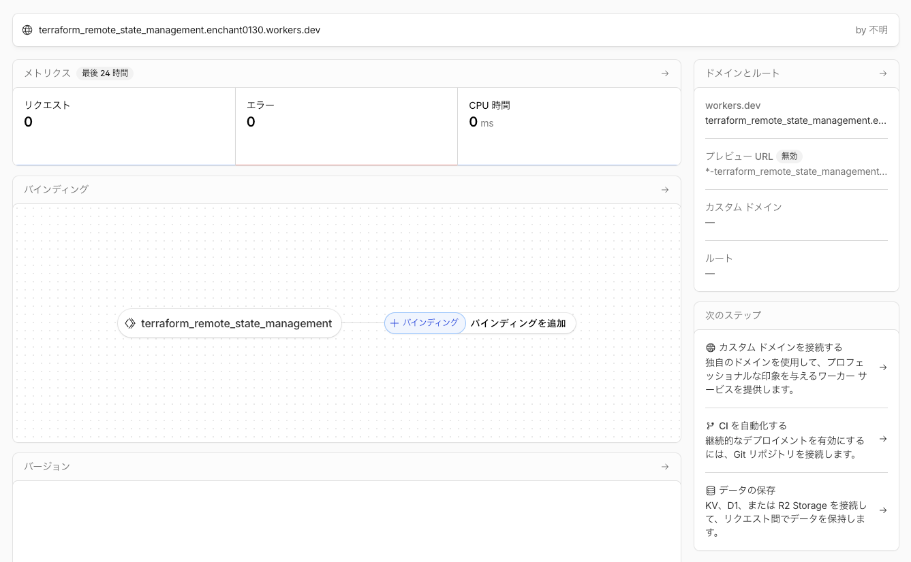
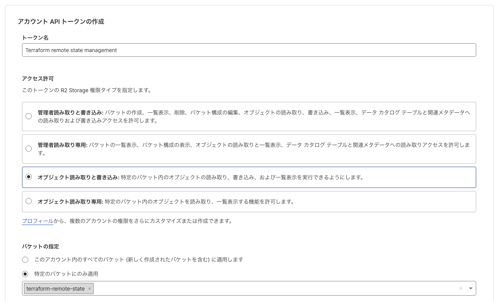

# development memo

## 適当なWorkerスクリプトを作る

```sh
pnpm add -D wrangler
```

`src/index.js` に関数 `fetch` を実装・exportしておく

```js
export default {
    async fetch() {
        return Response.json({
            message: "Hello, Cloudflare Workers!"
        })
    }
}
```

動作確認

```sh
pnpm dev
curl localhost:8787
```

```json
{"message":"Hello, Cloudflare Workers!"}
```

## R2バケットを作成する

Cloudflareのアカウントを作成し、R2バケットを作成 ここでは _terraform-remote-state_ とした



## Workersプロジェクトを作成する

Workersプロジェクトの生成処理をHCLで記述する

```hcl
terraform {
  required_providers {
    cloudflare = {
      source  = "cloudflare/cloudflare"
      version = "5.12.0"
    }
  }
}

variable "cloudflare_api_token" {
  type = string
}

variable "cloudflare_account_id" {
  type = string
}

provider "cloudflare" {
  api_token = var.cloudflare_api_token
}

resource "cloudflare_worker" "worker" {
  account_id = var.cloudflare_account_id
  name       = "terraform_remote_state_management"
  observability = {
    enabled = true
  }
  subdomain = {
    enabled          = true
    previews_enabled = false
  }
}
```

変数 `cloudflare_api_token`, `cloudflare_account_id` は別途ファイル `terraform.tfvars` を作成し、そちらに書いておく
(最低限Workersの編集ができる程度の権限をつけたAPIトークンを作成しておく。詳細は割愛する)

```sh
terraform init
```

問題なく初期化されたら適用してみる

```sh
terraform apply
```

空のWorkersプロジェクトが作成された



混乱を防ぐため、いったんこのリソースは削除しておく

```sh
terraform destroy
```

## StateをR2で管理する

ここまでの手順を実行すると、ファイル `terraform.tfstate` が生成されている
ここにすべてが記載されているため、このファイルをR2で管理してあげればCI環境でも状態を共有できる

### APIキーを作成する

R2 object storage -> Account Details -> API Tokens -> Manage に移動し、
今回作成したバケットにのみ読み書きを許可するトークンを生成する



### バックエンド構成を作成する

Ref: [Remote R2 backend · Cloudflare Terraform docs](https://developers.cloudflare.com/terraform/advanced-topics/remote-backend/)

R2をstate管理に使うには、Terraformの `backend` に `s3` を設定してやればよい イメージこんな感じ:

```hcl
terraform {
  backend "s3" {
    endpoints = {
      s3 = "<endpoint URL>"
    }

    access_key = "<key>"
    secret_key = "<secret>"

    bucket = "terraform-remote-state"
    key    = "/path/to/terraform.tfstate"
    region = "auto"

    // 省略
  }

  // 省略
}
```

しかしこれをそのまま使うと、APIトークンを `main.tf` に直書きすることになってしまう
そこで git-ignoredな `r2.tfbackend` ファイルを別途作成し、トークンはこちらに記載する

(`.tfbackend` は別にTerraformが直接サポートしている拡張子というわけではない)

```hcl
endpoints = {
    s3 = "https://<account_id>.r2.cloudflarestorage.com"
}
access_key = "<r2_key>"
secret_key = "<r2_secret>"
```

`terraform init` する際に、このファイルをオプションとして与える

```sh
terraform init -backend-config r2.tfbackend
```

> [!NOTE]
>
> このオプションは `plan` および `apply` を実行するときは不要
